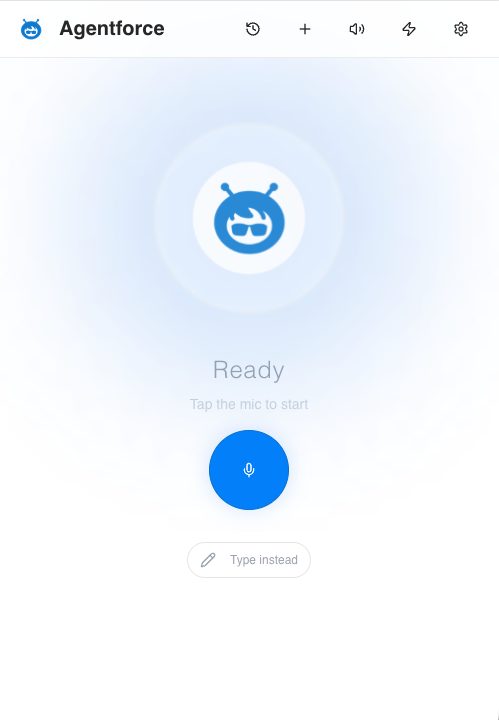
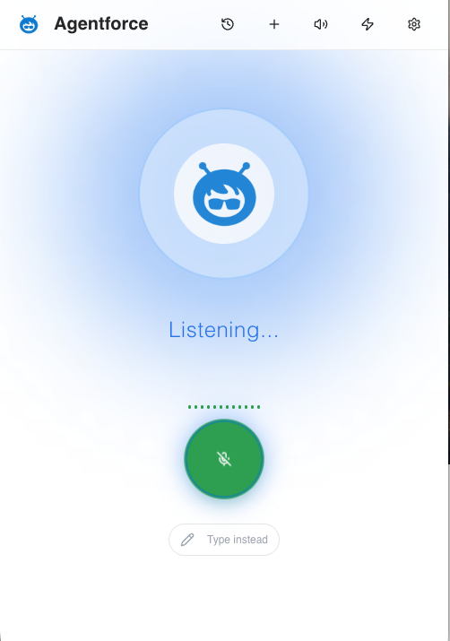

# Agentforce Speech App

> A production voice interface for Salesforce Agentforce agents — built by a practitioner, used in enterprise deals.

[](http://sfdc.co/CGEon)

---

## Why I Built This

Agentforce lets users talk to their CRM — ask questions, trigger automations, update records — using natural language. This app gives that capability a voice interface: speak to your agent, get a spoken response, hands-free on any device. A field rep can log notes after a customer visit without touching a keyboard. A support agent can pull case history mid-call by asking for it. A manager can check pipeline status on the way to a meeting.

The underlying Agentforce agent handles the business logic. This app makes it accessible by voice, as a native-feeling PWA that installs on iPhone and Android in seconds.

I built it for my own use across enterprise deals in manufacturing, retail, automotive, energy, and consumer goods — then open-sourced it after watching teammates spend hours standing up their own versions from scratch. The one-click Heroku deploy gets any SE from zero to live demo in under an hour, no command line required.

---

| Ready | Listening |
|---|---|
|  |  |

---

## What It Does

- **Voice-first conversation** with any Salesforce Agentforce Service Agent via the Agentforce API
- **Streaming responses with early TTS** — SSE streaming begins playing the first complete sentence via TTS before the full response arrives, reducing perceived latency
- **Agent Transparency Panel** — a real-time sidebar showing per-request pipeline timing (STT, agent processing, session creation), Salesforce session IDs, message type breakdowns, and expandable raw API responses; designed for technical reviews and demos
- **Premium speech quality** — ElevenLabs Scribe v1 for transcription, ElevenLabs Allison for natural TTS, via Salesforce Speech Foundations API
- **Animated visual feedback** — state-driven ripple effects (blue recording → yellow thinking → green speaking) that make the AI feel alive during demos
- **PWA** — installs on iPhone and Android as a native app; no App Store required
- **Conversation history** — PostgreSQL-backed session persistence across interactions
- **Voice-only mode** — hands-free operation for field demos and accessibility use cases
- **One-click deploy** — full Heroku deployment via web UI, no CLI required

---

## Architecture

```
Client (React 18 + TypeScript + Vite)
    ├── PWA shell (service worker, manifest, offline UI)
    ├── Voice recording (MediaRecorder — WebM/Opus, M4A fallback for iOS Safari)
    ├── SSE streaming consumer with early TTS latency optimization
    ├── Agent Transparency Panel (per-request observability)
    ├── Animated UI (Tailwind + shadcn/ui)
    └── Server state via React Query; routing via wouter (2KB)

Server (Node.js + Express + TypeScript)
    ├── Salesforce Agentforce API client
    │     └── SSE streaming endpoint with JSON fallback + conversation expiry recovery
    ├── Salesforce Speech Foundations API proxy (STT + TTS)
    ├── Two independent OAuth2 client-credentials connections
    │     └── In-memory token caching with 25-min expiry
    └── IStorage interface → MemStorage (default) or PostgreSQL (swap-in)

Database (PostgreSQL via Drizzle ORM)
    ├── Conversation sessions
    └── Message turns (user + agent, with Salesforce message IDs)

Tests (Vitest)
    └── Agentforce client, storage layer, transparency pipeline
```

**Tech stack:** TypeScript · React 18 · Node.js · Express · PostgreSQL · Drizzle ORM · Salesforce Agentforce API · Salesforce Speech Foundations · ElevenLabs · Heroku

---

## Technical Decisions Worth Noting

**SSE streaming with graceful fallback.** The `/api/agentforce/stream` endpoint exposes Agentforce responses as Server-Sent Events. The client streams chunks in real time, showing text as it arrives. If the SSE endpoint is unavailable or returns an error event, the client transparently falls back to the blocking `/api/agentforce` endpoint. Conversation expiry (404) triggers automatic session recovery rather than an error state.

**Early TTS latency optimization.** Rather than waiting for the full agent response before starting text-to-speech, the streaming client watches for the first complete sentence (ending in `.`, `!`, or `?`) and fires TTS immediately. For responses longer than a sentence, the user hears audio start while generation continues — cutting perceived latency significantly.

**Dual independent OAuth2 connections.** The Agentforce API and Speech Foundations API each use a separate OAuth2 client credentials flow with their own Connected App credentials. Tokens are cached in memory with a 25-minute expiry and refreshed automatically. Credentials are never exposed to the frontend; all Salesforce communication is server-to-server.

**Agent Transparency Panel.** A collapsible sidebar (bottom sheet on mobile, side panel on desktop) surfaces the full pipeline for every interaction: STT processing time and audio size, Agentforce session ID and whether a new session was created, agent processing time, response message count and types from the raw Salesforce API response, and an expandable raw JSON viewer. This was built specifically for technical demo reviews where buyers want to see what's actually happening under the hood.

**iOS Safari audio handling.** iOS requires an audio context unlock during a user gesture before `HTMLAudioElement.play()` can be called programmatically. The recording button fires `unlockAudioForSafari()` on `onBeforeRecording`. Recording uses WebM/Opus where available, with M4A fallback for Safari. A single "blessed" audio element ref is reused for TTS playback to avoid iOS autoplay restrictions.

**Storage interface abstraction.** `IStorage` defines all CRUD operations; the default export is `MemStorage` (in-memory Maps — zero dependencies, works without a database configured). Swapping to PostgreSQL requires only implementing `IStorage` and replacing the export. This made local development and testing straightforward without requiring a running database.

---

## Agent Design Considerations

Not all Agentforce agents work equally well in voice contexts. Before deploying, review [`AGENT_TYPES_AND_CONSIDERATIONS.md`](./AGENT_TYPES_AND_CONSIDERATIONS.md) — it covers:

- Which agent types are suited for voice vs. chat (Service Agent vs. Employee Agent, and why)
- How to tune agent instructions for spoken responses (concise, no markdown, natural sentence structure)
- Latency tradeoffs between model quality and response speed
- What breaks in voice that looks fine in a chat UI

---

## Demo Tips

**Voice-Only Mode** (most impressive for live demos): Toggle off "Show Conversation" to show only the visual feedback animation. Clean, theatrical, immediately understandable to a non-technical executive audience.

**Hybrid Mode** (better for technical reviews): Keep the conversation log visible to show persistence, context retention, and full interaction history.

**Transparency Mode** (for technical buyers): Open the Agent Transparency Panel to show real-time pipeline timing, session management, and raw Salesforce API responses. Makes the "how does this work" conversation concrete.

**Before any demo:**
- Visit your Heroku URL 15 minutes early to wake the dyno
- Test end-to-end on the actual device you'll demo on
- Prepare 3–5 questions tuned to your agent's configured topics

---

## Setup

You'll need:
- A Salesforce org with Einstein and Agentforce enabled
- An active Agentforce Service Agent
- A Heroku account ([Salesforce employees: sign up here](https://basecamp.salesforce.com/content/techforce-heroku-for-sfdc-employees))

**Total setup time: ~30–45 minutes**

### Credentials You'll Gather

| Variable | Source |
|---|---|
| `SALESFORCE_DOMAIN_URL` | Setup → My Domain |
| `SALESFORCE_CONSUMER_KEY` | Connected App → Consumer Details |
| `SALESFORCE_CONSUMER_SECRET` | Connected App → Consumer Details |
| `SALESFORCE_AGENT_ID` | Agent Builder URL (`0Xx...`) |
| `SALESFORCE_SPEECH_DOMAIN_URL` | Same as Domain URL |
| `SALESFORCE_SPEECH_CONSUMER_KEY` | External Client App → Consumer Details |
| `SALESFORCE_SPEECH_CONSUMER_SECRET` | External Client App → Consumer Details |

> Full step-by-step walkthrough below. Every step uses the Salesforce and Heroku web interfaces — no terminal required.

---

## Part 1: Salesforce Org Setup

### Enable Einstein

1. Setup → search **Einstein Setup**
2. Toggle **Turn on Einstein** → refresh the page

### Enable Agentforce

1. Setup → search **Agentforce Agents**
2. Click **Turn on Agentforce** → refresh the page

### Create an Agentforce Service Agent

> This app is designed for **Agentforce Service Agent**. It has not been tested with Employee Agent.

1. Setup → **Agentforce Agents** → **New Agent** → **Service Agent**
2. Add name, description, topics, instructions, and data sources
3. **Save** → **Activate** → **Deploy**
4. Open the agent and copy the Agent ID from the URL (the string after the last `/`, starts with `0Xx`)
5. Save as `SALESFORCE_AGENT_ID`

### Get Your Domain URL

1. Setup → **My Domain**
2. Copy your full domain URL (e.g. `https://your-domain.my.salesforce.com`)
3. Save as both `SALESFORCE_DOMAIN_URL` and `SALESFORCE_SPEECH_DOMAIN_URL`

---

## Part 2: Connected App for Agentforce API

### Create the App

1. Setup → **External Client Apps** → **Settings**
2. Enable **Allow access to External Client App consumer secrets via REST API**
3. Enable **Allow Creation of Connected Apps**
4. Click **New External Client App**
5. Fill in name and contact email

### Configure OAuth

- **Callback URL:** `https://login.salesforce.com`
- **Scopes to add:**
  - Access chatbot services (`chatbot_api`)
  - Access the Salesforce API Platform (`sfap_api`)
  - Manage user data via APIs (`api`)
  - Perform requests at any time (`refresh_token, offline_access`)
- **Uncheck:** Require PKCE, Require Secret for Web Server Flow, Require Secret for Refresh Token Flow
- **Check:** Enable Client Credentials Flow, Issue JWT-based access tokens

### Configure Policies

1. From the app → **Manage** → **Edit Policies**
2. **Permitted Users:** Admin approved users are pre-authorized
3. **Client Credentials Flow → Run As:** Select a system integration user
4. Save

### Get Credentials

1. Setup → App Manager → find your app → **View** → **Manage Consumer Details**
2. Verify identity, then copy:
   - Consumer Key → save as `SALESFORCE_CONSUMER_KEY`
   - Consumer Secret → save as `SALESFORCE_CONSUMER_SECRET`

### Connect App to Your Agent

1. Setup → **Agentforce Agents** → your agent → **Open in Builder**
2. **Connections** tab → turn on updated connections experience
3. **Messaging** connection → **External Apps** → **Add External App**
4. Select **API** connection type → choose your Connected App → Save

> Without this step, all API calls will fail with auth errors.

### Grant User Access

1. Setup → **Permission Sets** → **New**
2. Name it (e.g. "Agentforce Voice Connect App Permissions") → Save
3. **Assigned Connected Apps** → **Edit** → add your Connected App → Save
4. **Manage Assignments** → **Add Assignment** → select your integration user → Assign

---

## Part 3: External Client App for Speech Foundations API

### Create the App

1. Setup → **External Client App Manager** → **New**
2. Name it, add your email, keep **Distribution State: Local**

### Configure OAuth

- **Callback URL:** `https://login.salesforce.com`
- **Scopes:** `sfap_api`, `api`, `refresh_token, offline_access`
- **Check:** Enable Client Credentials Flow, Issue JWT-based access tokens
- **Uncheck:** Require PKCE

### Configure Policies

1. Edit the app → **OAuth Policies** → **Client Credentials Flow**
2. Enable, set **Run As** to your integration user
3. Enable JWT-based access tokens → Save

### Get Credentials

1. External Client App Manager → your app → **Settings** → **OAuth Settings** → **Consumer Key and Secret**
2. Copy:
   - Consumer Key → save as `SALESFORCE_SPEECH_CONSUMER_KEY`
   - Consumer Secret → save as `SALESFORCE_SPEECH_CONSUMER_SECRET`

---

## Part 4: Deploy to Heroku

### Click Deploy

Click the **Deploy to Heroku** button at the top of this README.

### Configure

1. Choose an app name and region
2. Fill in all environment variables from your credentials checklist above

> ⚠️ Both domain URLs **must** include `https://` — e.g. `https://your-domain.my.salesforce.com`

### Deploy

Click **Deploy app** → build takes 2–3 minutes. PostgreSQL provisions automatically.

**If the database doesn't provision automatically:**
1. App dashboard → **Resources** → search `postgres` → add **Heroku Postgres Essential-0** ($5/mo)
2. App dashboard → **More** → **Run console** → run `npm run db:push`

### Verify

1. **Open app** from the Heroku dashboard
2. Grant microphone permissions
3. Press and hold the mic button, speak a question, release
4. You should see: blue (processing) → yellow (thinking) → green (speaking) → audio response

---

## Managing Your Deployment

All management tasks work from the Heroku web dashboard at [dashboard.heroku.com](https://dashboard.heroku.com).

| Task | Where |
|---|---|
| View/edit env variables | Settings → Config Vars → Reveal Config Vars |
| View live logs | More → View logs |
| Restart app | More → Restart all dynos |
| Run DB migrations | More → Run console → `npm run db:push` |

---

## Troubleshooting

**"Failed to parse URL"** — Your domain URL is missing `https://`. Fix in Settings → Config Vars.

**401 Unauthorized** — Verify Consumer Key/Secret are correct. Wait 2–10 minutes after creating or modifying Connected Apps for propagation. Confirm Client Credentials Flow is enabled and the Connected App is linked to your agent (Part 2).

**"Agent not found"** — Verify the Agent ID, confirm the agent is activated and deployed, and confirm the Connected App is added to the agent under Connections.

**Microphone doesn't work** — Grant permissions in your browser. Must be on HTTPS (Heroku provides this). On iOS, tap rather than hold to trigger the permission dialog first.

**No audio** — Check browser audio permissions, device volume, and iOS mute switch.

---

## Deploy Another Instance

Click **Deploy to Heroku** again. Each deployment is fully independent with its own database. To demo a different agent, deploy a new instance and change only `SALESFORCE_AGENT_ID`.

---

## Contributing

See [`CONTRIBUTING.md`](./CONTRIBUTING.md). Issues and PRs welcome.

---

*Built for enterprise AI demos that need to land in the room.*
